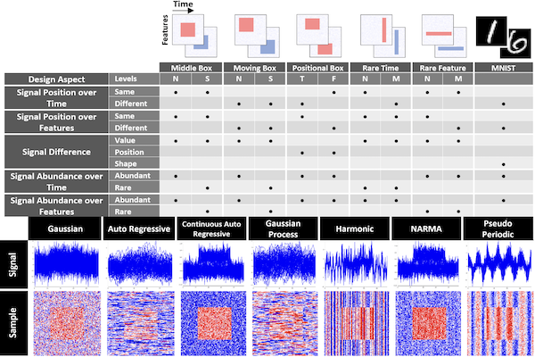

# Benchmarking Deep Learning Interpretability in Time Series Predictions

Code implementing the benchmark introduced in "Benchmarking Deep Learning Interpretability in Time Series Predictions" by
Aya Abdelsalam Ismail, Mohamed Gunady, Hector Corrada Bravo*, Soheil Feizi*.


## Overview:
Saliency methods are used extensively to highlight the importance of input features in model predictions. These methods are mostly used in vision and language tasks, and their applications to time series data is relatively unexplored. In this paper, we set out to extensively compare the performance of various saliency-based interpretability methods across diverse neural architectures, including Recurrent Neural Network, Temporal Convolutional Networks, and Transformers in a new benchmark of synthetic time series data. We propose and report multiple metrics to empirically evaluate the performance of saliency methods for detecting feature importance over time using both precision (i.e., whether identified features contain meaningful signals) and recall (i.e., the number of features with signal identified as important). Through several experiments, we show that (i) in general, network architectures and saliency methods fail to reliably and accurately identify feature importance over time in time series data, (ii) this failure is mainly due to the conflation of time and feature domains, and (iii) the quality of saliency maps can be improved substantially by using our proposed two-step temporal saliency rescaling (TSR) approach that first calculates the importance of each time step before calculating the importance of each feature at a time step.

## Prerequisites:
* Python 3.6.3 or higher
* NumPy
* Pytorch
* Matplotlib
* Pandas
* Sklearn
* Argparse
* Sys
* timesynth
* captum


## Usage:
- Create the following folder structure.
```
TS-Interpretability-Benchmark
    │
    ├── Scripts
    │  ├── Plotting
    │  └── Models
    │ 
    ├──Results
    │  ├── Saliency_Values
    │  ├── Saliency_Masks
    │  ├── Saliency_Distribution
    │  ├── Precision_Recall
    │  ├── Masked_Accuracy
    │  └── Accuracy_Metrics
    │ 
    ├──Models
    │  ├── Transformer
    │  ├── TCN
    │  ├── LSTMWithInputCellAttention
    │  └── LSTM
    │ 
    ├──Graphs
    │  ├── Saliency_Maps
    │  ├── Saliency_Distribution
    │  ├── Precision_Recall
    │  ├── Datasets
    │  └── Accuracy_Drop
    │
    ├── Datasets
    │
    └── MNIST Experiments
        ├── Scripts
        ├── Models
        ├── Graphs
        └── Data
```
- The code for the benchmark is available under Scripts folder to run full benchmark run ```python run_benchmark.py```.
- MNIST experiments and TSR under MNIST Experiments.
